  <picture>
    <source media="(prefers-color-scheme: dark)" srcset="dark.svg">
    <source media="(prefers-color-scheme: light)" srcset="light.svg">
    
  </picture>

## 🌟 About Me

- 🎓 MSc student at Dublin City University
- 🛠️ Building full-stack products with applied AI: CivicPulse pairs Gemini Vision with a FastAPI + React stack to turn a photo into a routed municipal complaint
- 🔬 Research background in LLM evaluation: co-author on an IEEE benchmark paper testing three LLMs across three prompting strategies on real government planning documents
- 🧪 Care about reproducibility: the benchmark repo ships a strict no-leakage evaluation design and 438 unit tests, not just a notebook
- 📍 Based in Dublin, Ireland
- 📫 Reach me at smadhu6364@gmail.com

## 🛠️ Tech Stack

  
  
  
  
  
  
  
  
  
  

- **Languages:** Python, JavaScript, SQL
- **Frameworks & Libraries:** React, FastAPI, Django, Leaflet.js
- **AI / ML:** Gemini API, Prompt Engineering, scikit-learn
- **Data & Infra:** Firebase, REST APIs, Docker
- **Tools:** Git, GitHub
- **Project delivery:** solo project scoping and delivery, requirements analysis, technical documentation, experimental design

*(That last line is deliberately modest: it reflects delivering CivicPulse and the benchmark study end to end, not a formal project-management job title or certification.)*

## 🚀 What I Do

- ⚙️ Design and ship full-stack products end to end: frontend, backend, and AI integration
- 🔬 Run reproducible ML/LLM evaluation research: no-leakage design, automated test suites
- 🗺️ Build geospatial and real-time data apps: live maps, crowd-verified reporting
- 🧪 Write tests, not just demos: the benchmark repo carries 438 of them
- 📐 Scope and deliver multi-week technical projects solo, start to finish

## 📌 Featured Projects

**[CivicPulse](https://github.com/smadhu6364-beep/civicpulse)**
 A civic issue reporting platform. A resident uploads a photo of a local problem; Gemini Vision classifies the issue, scores its severity, identifies the responsible municipal authority, and drafts a formal complaint letter automatically. Every report lands on a live map where the community can verify and upvote it.
 `React` `FastAPI` `Gemini Vision` `Firebase` `Leaflet.js`

**[LLM Risk Register Benchmark](https://github.com/smadhu6364-beep/public-reproducible-benchmark)**
 Code and data for an IEEE conference paper benchmarking three LLMs across three prompting strategies on automated risk register generation from real project planning documents (21 World Bank and UK government sources). Full reproducible pipeline, strict no-leakage evaluation design, and 438 unit tests.
 `Python` `LLM Evaluation` `Research`

**[Foodiepy](https://github.com/smadhu6364-beep/foodiepy)**
 A Django food-demand forecasting and inventory management app, built together with three other contributors. A gradient boosting model forecasts fulfilment-center order volume; a separate module lets restaurant owners manage inventory, customers, and orders.
 `Django` `scikit-learn` `SQLite`

## 🌐 Connect With Me

